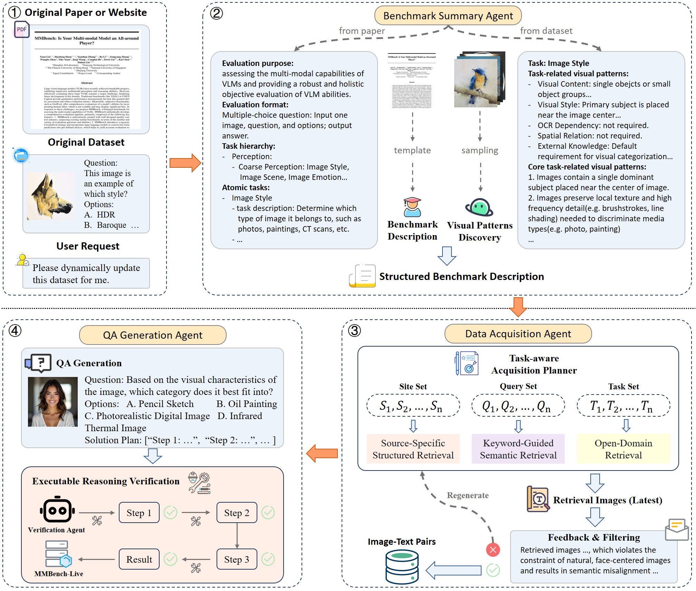

# MMBench-Live: A Continuously Evolving Benchmark for Multimodal Models

## 🔥 News
MMBench-Live has been accepted at ICML 2026!

## 👀 Introduction
Evaluation benchmarks are essential for measuring the capabilities of vision–language models (VLMs). Existing multimodal benchmarks are mostly static, which makes them prone to data contamination, temporal staleness, and high construction costs. To address these challenges, we propose MMBench-Live, a dynamic, multi-agent-driven benchmark that continuously updates without human intervention. It integrates structured benchmark descriptions, real-time data collection, and automated QA generation, enabling scalable and low-cost evaluations. Additionally, a distribution-consistent updating strategy ensures reliable and fair evaluation across versions, while maintaining data diversity and quality.



## 💾 Environment
### Create conda environment
```bash
conda create -n mmbench-live python=3.10.16 -y
conda activate mmbench-live
```
### Clone the repo
```bash
git clone https://github.com/SupineYoke123/MMBench-Live.git
cd MMBench-Live
```
### Install required packages
```bash
pip install -r requirements.txt
```
### [Optional] Install Playwright
```bash
pip install playwright
python -m playwright install chromium
```

## ⚙️ Configuration
Before running the project, you need to set up the necessary API keys and configuration parameters. The project will look for environment variables by default, but you can also modify the configuration file directly.

### ✅Required API Keys

| Environment Variable | Description |
|--------------------|-------------|
| `OPENAI_API_KEY`   | API key for OpenAI models |
| `GEMINI_API_KEY`   | API key for Google AI Studio |
| `SERPER_API_KEY`   | API key for Serper image search |

### [Optional]Required for Running Agents
To run the agents, you **must** configure the following:

| Environment / Variable | Description |
|------------------------|-------------|
| `FLICKR_API_KEY`       | API key for Flickr image search |
| `TAVILY_API_KEY`       | API key for Tavily image search |
| `BENCHMARK_SUMMARY_AGENT_MCP_PORT` | Port for the benchmark summary agent |
| `DATA_ACQUISITION_AGENT_MCP_PORT` | Port for the data acquisition agent |
| `QA_GENERATION_AGENT_MCP_PORT` | Port for the QA generation agent |
| `QA_VALIDATE_AGENT_MCP_PORT` | Port for the QA validation agent |
| `SEGMENTATION_MCP`     | URL for segmentation service |
| `VISION_MCP`           | URL for vision service |
| `DEPTH_MCP`            | URL for depth service |

## 🚀 Quick Start
This section provides instructions for quickly running the project in two modes: **Non-Agent Pipeline** and **Agent Pipeline**.
### 1️⃣ Non-Agent Pipeline
If you **do not want to run the agents**, a simplified pipeline is provided.

**Notes:**  
- Only the Google image API is used for data acquisition.  
- The QA validation step is skipped.

**Steps:**
1. Run the benchmark summary script:
```bash
python pipeline/benchmark_summary.py
```
2. Run the data acquisition script:
```bash
python pipeline/data_acquisition.py
```
3. Run the QA generation script:
```bash
python pipeline/qa_generation.py
```

### 2️⃣ Agent Pipeline
If you want to run the agents, make sure all required API keys, MCP endpoints, and ports are properly configured (see ⚙️ Configuration section).

**Steps:**
1. Open separate terminals for each agent and run:
```bash
# Terminal 1
python agents/benchmark_summary_agent.py

# Terminal 2
python agents/data_acquisition_agent.py

# Terminal 3
python agents/qa_generation_agent.py

# Terminal 4
python agents/qa_validate_agent.py
```
2. Run the main agent runner:
```bash
python agent_run.py
```

## 🔗 Citation
If you find this work useful for your research, please kindly cite our paper:
```
@unpublished{liu2026mmbenchlive,
  title={{MMB}ench-Live: A Continuously Evolving Benchmark for Multimodal Models},
  author={Yuanzhi Liu and Shousheng Zhao and Bo Zhou and Kongming Liang and Zhanyu Ma},
  booktitle={Forty-third International Conference on Machine Learning},
  year={2026},
}
```
